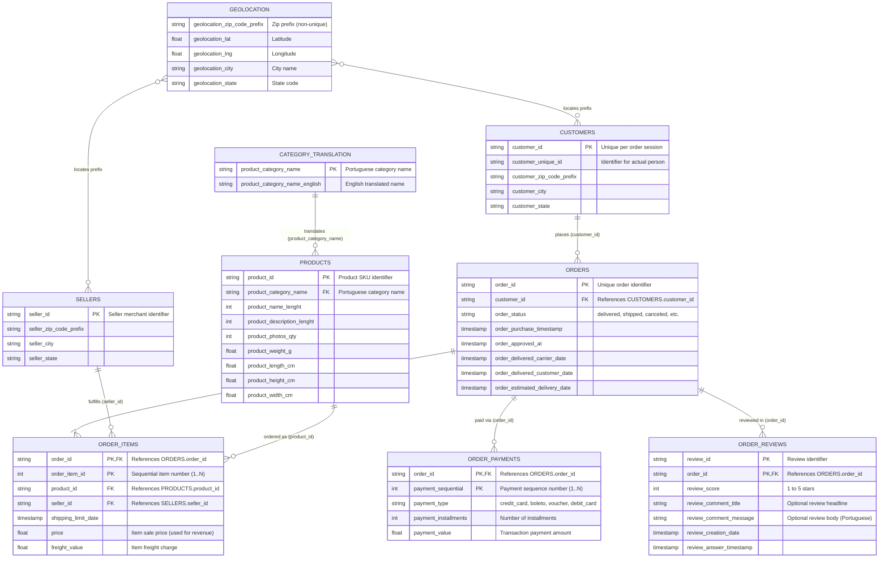

# Olist E-Commerce Entity-Relationship Diagram

## Entity Notes and Key Invariants
1. **Customer Grain (`customer_id` vs `customer_unique_id`)**:
   - `customer_id` is 1:1 with an order row.
   - `customer_unique_id` tracks an individual human over multiple purchases across time.
2. **Order Revenue Definition**:
   - `SUM(order_items.price)` on delivered orders.
   - Payments (`order_payments.payment_value`) include freight, vouchers, and card processing fees; item prices reflect actual product merchandise value.
3. **Review Multiplicity**:
   - Primary key is composite `(review_id, order_id)` due to occasional multi-order reviews or duplicate survey submissions.
4. **Geolocation**:
   - Geolocation is a spatial lookup table with multiple coordinate samples per `zip_code_prefix`. It does not have a single-column primary key.
