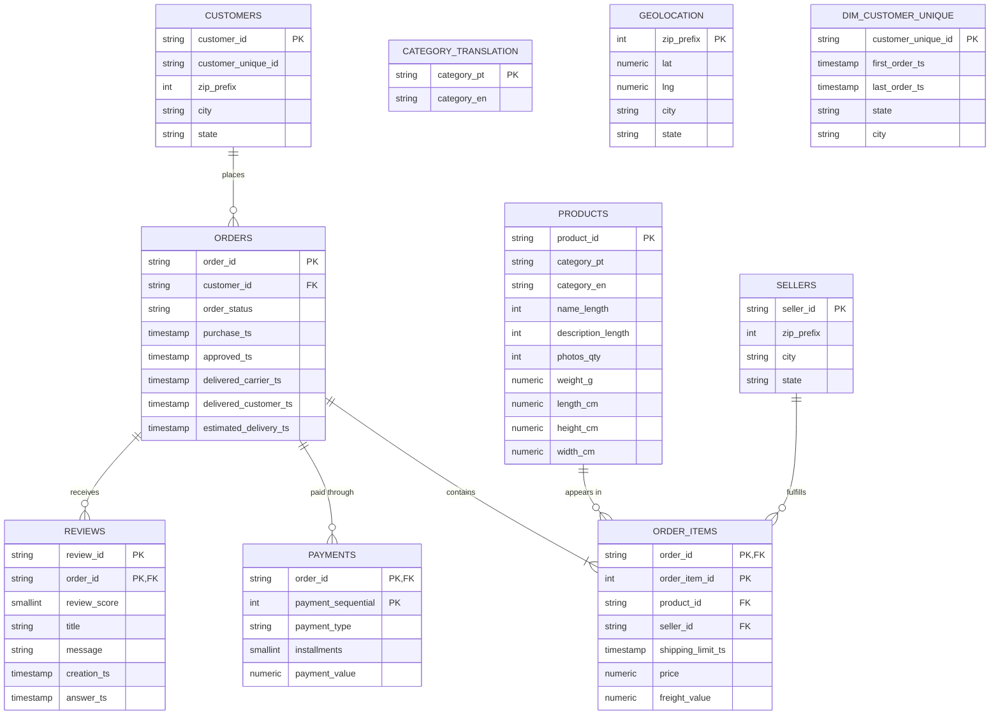

# Core schema entity relationship diagram

`customers.customer_unique_id` identifies a person across order-specific customer IDs. It is
indexed but is not a foreign key to `dim_customer_unique`, which is populated after the order
facts in the Phase 3 load sequence. `products.category_pt` and `category_en` are intentionally
not foreign keys: some source categories do not have translations. `geolocation` is a one-row-per-
zip-prefix reference table and is not constrained to customer or seller rows.

Revenue is merchandise value: `SUM(order_items.price)` for delivered orders. Freight is excluded.
